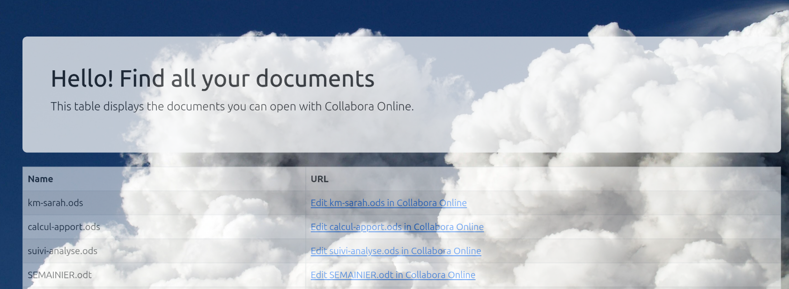

# WOPIServer
A lightweight WOPIServer

Ce serveur est très simple, sur le principe que plus un système est simple, moins il a de chances de tomber en panne.

Par exemple, il n'y pas de droits d'accès et on ne peut pas avoir plusieurs utilisateurs simultanés. Il faudrait mettre en œuvre le système de verrous et le système de droits d'accès (faire reposer les droits d'accès sur les droits du système de fichier, implique d'avoir un utilisateur sur la machine pour chaque utilisateur du logiciel). Cela n'a pas été implanté parce que je suis pour l'instant le seul utilisateur. Mais ce ne serait pas long à développer.

Le serveur une fois lancé expose des services REST, accessibles par la suite bureautique, mais aussi un service https qui permet d'afficher la liste des fichiers. Cette liste de fichier est cliquable et permet de se connecter à Libre Office avec la bonne URL. C'est la raison des paramètres proxyHost et code URL de l'application : être en mesure de générer la bonne URL.



Le code est prévu pour avoir plusieurs backends à l'aide d'une interface. Le seul mis en œuvre pour l'instant c'est un stockage sur disque local (avec auto discovery : on lui donne un répertoire et il expose tout les documents du répertoire).

Il consomme peu de ressources, la charge dépendra plus de Collabora Online ou d'OnlyOffice. Le serveur WOPI se contente de lire un fichier à l'ouverture et de l'écrire de temps en temps (comme lors des enregistrements automatiques).

Il n'est pas testé avec OnlyOffice. En principe WOPI est une norme et ça devrait fonctionner.

Je suis ouvert à toute requête :-)

# Compiler
un truc du genre `./gradlew bootJar` devrait "faire the trick"

# Lancer
On peut le lancer avec java -jar. C'est du [Spring Boot](https://spring.io/). On pourrait utiliser systemd. De mon côté, je l'ai mis dans un container docker qui lance la commande suivante

```
java -Dlogging.level.root=INFO \
     -Dlogging.level.org.wopiserver=INFO \
     -Dserver.port=8880 \
     -jar /opt/app/app.jar \
     --baseDir /mnt/docs \
     --disableTLSCheck \
     --codeURL https://172.17.0.8:9980 \
     --proxyHost 192.168.124.252
```

# Lancer avec Docker
j'utilise pour se faire une stack compose :

```
version: "3.2"

services:
  libreoffice:
    image: "collabora/code:latest"
    environment: 
      - username=admin
      - password=verysecretpass
    ports:
      - "9980:9980/tcp"
    network_mode: bridge
    links:
      - wopiserver

  wopiserver:
    image: "wopiserver:0.2"
    ports:
      - "8880:8880/tcp"
    volumes:
       - "/nas-pool/nasroot/backup/shared-document-lool:/mnt/docs"
       - "/var/lib/docker/laurent/libreoffice-online/etc:/etc/wopi"
       - "/var/lib/docker/laurent/libreoffice-online/opt:/opt/app"
    network_mode: bridge
```

et le Dockerfile suivant pour le container WoPiX

```
FROM eclipse-temurin:21
RUN mkdir /opt/app
CMD ["java", "-Dlogging.level.root=INFO", "-Dlogging.level.org.wopiserver=INFO", "-Dserver.port=8880", "-jar", "/opt/app/app.jar", "--baseDir", "/mnt/docs", "--disableTLSCheck", "--codeURL", "https://172.17.0.8:9980", "--proxyHost", "192.168.124.252"] 
```
